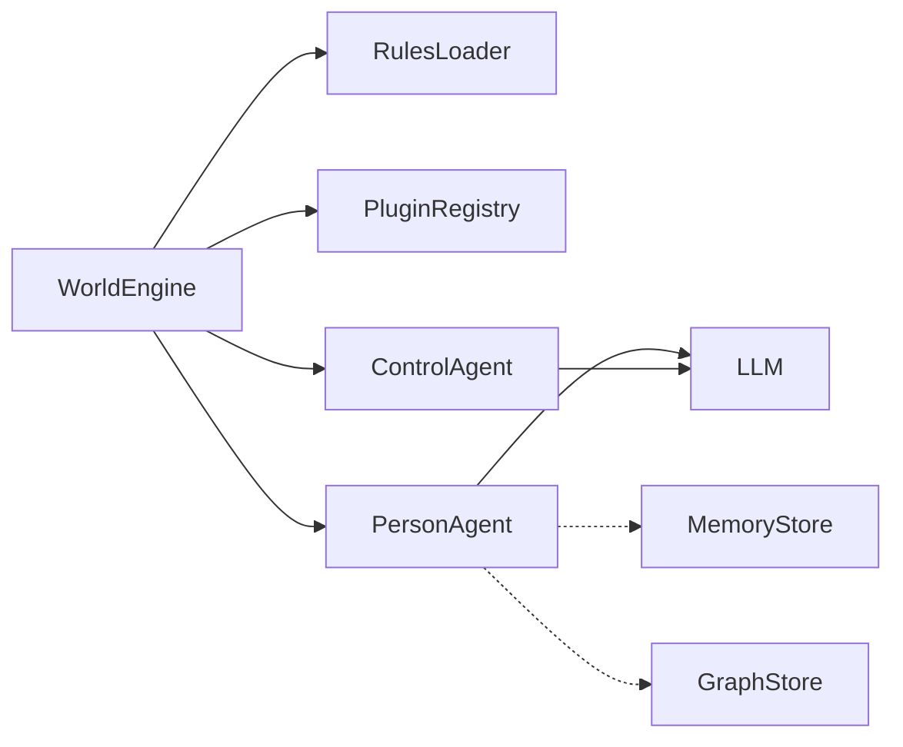

# worldsim

Abstract virtual-world emulator with LangGraph agents: a plugin-based multi-agent simulation engine for Node.js/TypeScript, with governance (**control**) and persona (**person**) agents. The LLM is integrated through an OpenAI-compatible API adapter (OpenAI, Anthropic-compatible proxies, Ollama, etc.).

## Features

- **Multi-agent simulation** with LangGraph-powered reasoning loops
- **ControlAgent** for governance: watches rules and can pause or stop agents
- **PersonAgent** with agentic loops and lifecycle guards
- **Plugin system** with hooks on world events and registerable tools
- **Rules engine** that loads JSON files and optionally PDFs (LLM extraction at bootstrap)
- **LLM-agnostic** via an OpenAI-compatible adapter
- **Optional persistence**: with no stores configured, ephemeral state stays in RAM for the session; you can plug in [`MemoryStore`](src/types/MemoryTypes.ts) and [`GraphStore`](src/types/GraphTypes.ts) for long-term memory and inter-agent relationships (see [Persistence and databases](#persistence-and-databases))

## Requirements and installation

- **Node.js** (LTS recommended)
- An **API key** for your chosen LLM endpoint (e.g. `OPENAI_API_KEY` for the official OpenAI API)

```bash
npm install worldsim
```

If you work from this repository’s source:

```bash
npm install
npm run build
```

Typical environment variables (`.env` file or shell):

| Variable | Purpose |
|----------|---------|
| `OPENAI_API_KEY` | Calls to the OpenAI API (or compatible services that require it) |
| `REDIS_URL` | Redis integration tests (e.g. `redis://localhost:16379` with the test Docker stack) |
| `NEO4J_URI`, `NEO4J_USER`, `NEO4J_PASSWORD` | Neo4j integration tests |

## Using the platform (four steps)

1. **Create a `WorldEngine`** with [`WorldConfig`](src/types/WorldTypes.ts): at minimum `llm` (`baseURL`, `apiKey`, `model`); optionally `rulesPath` (JSON and/or PDF globs), `memoryStore`, `graphStore`, `maxTicks`, `tickIntervalMs`, `worldId`.
2. **Register plugins** with `world.use(plugin)`: logging, observability, and **tools** exposed to person agents (see [Tools and plugins](#tools-and-plugins)).
3. **Add agents** with `world.addAgent(config)`:
   - `role: "control"`: governance (built-in `control_agent` tool).
   - `role: "person"`: LangGraph-loop agents; they can use plugin tools via `toolNames` (subset) or all registered tools when `toolNames` is omitted; you can also pass `tools` inline on [`AgentConfig`](src/types/AgentTypes.ts).
4. **Start and manage lifecycle**: `await world.start()`; the host app may call `pauseAgent`, `resumeAgent`, `stopAgent` and listen to `world.on("tick", ...)`. For a clean shutdown, call `world.stop()` (as in the `SIGINT` example in [`examples/basic-world/index.ts`](examples/basic-world/index.ts)).

## Architecture (overview)



- **Bootstrap**: load rules, `onBootstrap` / `onRulesLoaded` hooks, construct agents with the same optional `memoryStore` and `graphStore` from the world config.
- **PersonAgent** optionally uses memory and graph to enrich context and persist actions/relationships across ticks (see [`PersonAgent`](src/agents/PersonAgent.ts)).

## Tools and plugins

Plugins implement [`WorldSimPlugin`](src/types/PluginTypes.ts): hooks (`onWorldTick`, `onAgentAction`, `onAgentStatusChange`, `onWorldStop`, …) and optionally an array of **`tools`**.

Each tool is an [`AgentTool`](src/types/PluginTypes.ts): `name`, `description`, `inputSchema` (JSON Schema–compatible), `execute(input, ctx)` where `ctx` is the world’s [`WorldContext`](src/types/WorldTypes.ts).

```typescript
world.use({
  name: "my-plugin",
  version: "1.0.0",
  async onWorldTick(tick, ctx) {
    /* ... */
  },
  async onAgentAction(action, state) {
    return action;
  },
  async onAgentStatusChange(event, oldStatus, newStatus) {
    /* ... */
  },
  async onWorldStop(ctx, events) {
    /* ... */
  },
  tools: [
    {
      name: "my_tool",
      description: "...",
      inputSchema: {},
      execute: async (input, ctx) => {
        /* ... */
      },
    },
  ],
});
```

- **ControlAgent** exposes the built-in **`control_agent`** tool to pause, resume, or stop other agents according to the rules (see [`ControlAgent`](src/agents/ControlAgent.ts)).
- **PersonAgent** receives the union of tools registered on plugins (filtered by `toolNames` when set) and any `tools` passed on the agent config.

## Persistence and databases

No database is required: if you omit both `memoryStore` and `graphStore` on [`WorldConfig`](src/types/WorldTypes.ts), there is no external persistence beyond in-memory state for the run.

### Public contracts (npm package)

The package exports the interface types you implement in your backend:

- **`MemoryStore`**: save and query [`MemoryEntry`](src/types/MemoryTypes.ts) by agent, tick, and type (actions, observations, conversations, reflections).
- **`GraphStore`**: inter-agent nodes/relationships modeled as [`Relationship`](src/types/GraphTypes.ts) (strength, metadata, interaction ticks).

Pass a single instance per type to the world constructor; [`WorldEngine`](src/engine/WorldEngine.ts) forwards it to all agents that support it.

```typescript
const world = new WorldEngine({
  worldId: "my-world",
  llm: {
    baseURL: "https://api.openai.com/v1",
    apiKey: process.env.OPENAI_API_KEY!,
    model: "gpt-4o-mini",
  },
  memoryStore: myMemoryStore,
  graphStore: myGraphStore,
});
```

### Reference implementations in this repository

The **Redis** and **Neo4j** implementations are **not** shipped as dependencies of `worldsim`; they serve as **reference** code for integration tests and as a base to copy or adapt in your app:

- [`tests/integration/stores/RedisMemoryStore.ts`](tests/integration/stores/RedisMemoryStore.ts)
- [`tests/integration/stores/Neo4jGraphStore.ts`](tests/integration/stores/Neo4jGraphStore.ts)

For development and tests without external services, you can also follow the in-memory stores used in tests:

- [`tests/helpers/InMemoryMemoryStore.ts`](tests/helpers/InMemoryMemoryStore.ts)
- [`tests/helpers/InMemoryGraphStore.ts`](tests/helpers/InMemoryGraphStore.ts)

### Docker test environment (Redis and Neo4j)

From the repository root:

```bash
npm run test:docker:up    # start services from docker-compose.test.yml
npm run test:docker:down  # stop services
```

Example ports and credentials (aligned with [`docker-compose.test.yml`](docker-compose.test.yml)):

| Service | Host port | Notes |
|---------|-----------|-------|
| Redis | `16379` → 6379 in container | Typical URL: `redis://localhost:16379` |
| Neo4j Bolt | `7687` | Example user/password: `neo4j` / `testpassword` (`NEO4J_AUTH` in compose) |
| Neo4j Browser | `7474` | Optional HTTP UI |

Integration tests that use these services are run with `npm run test:integration` (requires `.env` and running services when not in CI).

## Rules

Rules load at bootstrap from **JSON** files (glob in `rulesPath.json`) and optionally **PDF** (`rulesPath.pdf`). For PDFs, content is extracted via LLM ([`PdfRulesParser`](src/rules/PdfRulesParser.ts)); a working LLM configuration is required for that step.

Example JSON file:

```json
{
  "version": "1.0.0",
  "name": "My Rules",
  "rules": [
    {
      "id": "rule-001",
      "priority": 1,
      "scope": "all",
      "instruction": "Agents must communicate respectfully.",
      "enforcement": "hard"
    }
  ]
}
```

## Agent lifecycle

Agents follow a state machine: `idle → running → paused → running` (resume) or `→ stopped` (terminal).

```
idle ──start──▶ running ──pause──▶ paused
                  │                   │
                  │──stop──▶ stopped ◀──stop──│
                                      │
                            (terminal, no transitions)
```

The host can drive agents with `world.pauseAgent()`, `world.resumeAgent()`, `world.stopAgent()`. ControlAgents can apply the same transitions autonomously via the `control_agent` tool.

## Quick start (code)

```typescript
import { WorldEngine, ConsoleLoggerPlugin } from "worldsim";

const world = new WorldEngine({
  worldId: "my-world",
  maxTicks: 20,
  tickIntervalMs: 500,
  llm: {
    baseURL: "https://api.openai.com/v1",
    apiKey: process.env.OPENAI_API_KEY!,
    model: "gpt-4o-mini",
  },
  rulesPath: {
    json: ["./rules/*.json"],
  },
});

world.use(ConsoleLoggerPlugin);

world.addAgent({
  id: "governance",
  role: "control",
  name: "Governance Agent",
  systemPrompt: "Monitor rules and enforce compliance.",
});

world.addAgent({
  id: "alice",
  role: "person",
  name: "Alice",
  iterationsPerTick: 3,
  systemPrompt: "You are a curious person who asks questions.",
});

world.addAgent({
  id: "bob",
  role: "person",
  name: "Bob",
  iterationsPerTick: 2,
  systemPrompt: "You are an enthusiastic person who proposes ideas.",
});

await world.start();
```

## Example in this repository

A fuller sample lives under [`examples/basic-world/`](examples/basic-world/) (lifecycle observer plugin, pause/resume/stop from ticks, rules from files).

The example imports `worldsim` like a project that installed the package from npm. **To run it locally without publishing:** from the repo root run `npm run build`, then `npm link`; in a separate Node project run `npm link worldsim`, copy the example (or equivalent imports), set `OPENAI_API_KEY`, and run the script with a TypeScript runner (e.g. `npx tsx index.ts`). Alternatively, after `npm install worldsim` in your app, paste the example into your entrypoint.

## npm scripts

| Command | Description |
|---------|-------------|
| `npm run build` | Build with tsup (CJS + ESM) |
| `npm run dev` | Watch build (tsup) |
| `npm test` | Unit tests (Vitest) |
| `npm run test:watch` | Vitest watch mode |
| `npm run test:integration` | Integration tests (requires `.env` and services where needed) |
| `npm run test:docker:up` | Start Redis and Neo4j for tests (`docker-compose.test.yml`) |
| `npm run test:docker:down` | Stop test containers |
| `npm run test:prompts` | promptfoo evaluations (requires `.env`) |
| `npm run test:all` | Run all tests |
| `npm run typecheck` | TypeScript typecheck |
| `npm run lint` | ESLint on `src` |

## Roadmap

For detailed development tasks and roadmap, see [`docs/tasks.md`](docs/tasks.md).

## License

MIT
