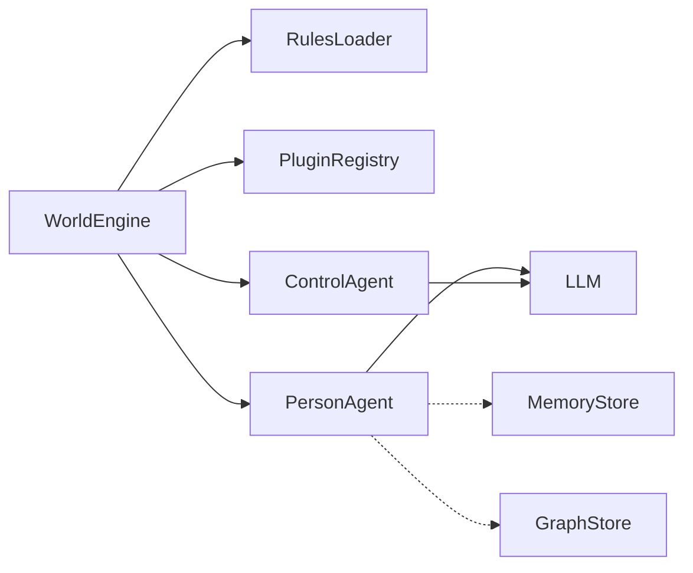

# worldsim

**Simulate how communities react to new rules, events, or policies — in TypeScript, in 5 minutes.**

WorldSim is an embeddable multi-agent simulation engine for Node.js. Define agents with distinct personalities, drop in a policy change, and watch coalitions form, conflicts emerge, and consensus build — all powered by LLM reasoning loops.

## Quick Start

```bash
npm install worldsim
OPENAI_API_KEY=sk-... npx worldsim demo
# Open http://localhost:4400 — watch a village react to water rationing
```

Or with Docker:

```bash
OPENAI_API_KEY=sk-... docker compose up
# Open http://localhost:4400
```

## What You Can Simulate

**Community Policy Impact** — 8 villagers face a new water rationing policy. The farmer resists, the mayor defends, the priest mediates, the technologist proposes solutions. Who forms coalitions? Who complies?

**Market Price Shocks** — 10 marketplace agents react when grain prices double overnight. Sellers profit, buyers protest, regulators intervene. Economic reasoning emerges from personality-driven agents.

**Information Cascades** — 12 agents in 4 social groups. A rumor starts with one person. Watch it spread (or not) through the social graph, distorted by each personality along the way.

See [`evaluation/`](evaluation/) for repeatable scenarios with expected behaviors and quality criteria.

## Code Example

```typescript
import { WorldEngine, ConsoleLoggerPlugin, InMemoryMemoryStore, InMemoryGraphStore } from "worldsim";

const world = new WorldEngine({
  worldId: "my-village",
  maxTicks: 20,
  llm: {
    baseURL: "https://api.openai.com/v1",
    apiKey: process.env.OPENAI_API_KEY!,
    model: "gpt-4o-mini",
  },
  memoryStore: new InMemoryMemoryStore(),
  graphStore: new InMemoryGraphStore(),
});

world.use(ConsoleLoggerPlugin);

world.addAgent({
  id: "maria", role: "person", name: "Maria Rossi",
  iterationsPerTick: 2,
  profile: { name: "Maria Rossi", personality: ["practical", "stubborn"], goals: ["Save the harvest"] },
  systemPrompt: "You are Maria, a farmer worried about water rationing.",
});

// Add more agents...

await world.start();
```

## Studio Dashboard

WorldSim includes a built-in web dashboard for real-time simulation monitoring:

```bash
npx worldsim studio
# Open http://localhost:4400
# Optional: --port 5000, --no-open
```

- **Live agent state** — mood, energy, goals, status
- **Event timeline** — every action, every tick
- **Relationship graph** — force-directed visualization of social connections
- **Simulation report** — mood heatmaps, energy charts, action distribution, timeline

Main sections available in the dashboard:

- **Agents** — inspect profile, current status, goals, mood and energy in real time
- **Timeline** — follow what happens at each tick, with a chronological event stream
- **Relationship Graph** — visualize who influences whom and how social ties evolve
- **Report** — review post-run metrics, trends, and behavior distribution

```typescript
import { studioPlugin } from "worldsim";

engine.use(studioPlugin({ engine, port: 4400, memoryStore, graphStore }));
```

### UI Examples

Relationship Graph view (real-time social connection map):


Agent Details view (profile, internal state, and memory timeline):


## Architecture



- **WorldEngine** orchestrates ticks, agents, plugins, and lifecycle
- **PersonAgent** — LangGraph-powered agents with personality, mood, energy, goals, and tool use
- **ControlAgent** — governance agent that monitors rules and can pause/stop violators
- **Plugin system** — hooks on every world event + registerable tools for agents
- **Rules engine** — load from JSON or PDF, with priorities and enforcement levels

## Key Capabilities

| Feature | Description |
| ------- | ----------- |
| **LLM-agnostic** | OpenAI, Anthropic proxies, Ollama — anything OpenAI-compatible |
| **Personality system** | Mood, energy, goals, beliefs, knowledge per agent |
| **Social dynamics** | Relationship tracking with strength decay, neighborhoods |
| **Rule enforcement** | Hard/soft rules, governance agent with autonomous control |
| **Scalability** | 1000+ agents via concurrency caps, activity scheduling, token budgets |
| **Zero-config persistence** | In-memory by default; plug in Redis, Neo4j, PostgreSQL for production |
| **Real-time streaming** | Socket.IO events for live dashboards |
| **Simulation reports** | Auto-generated analysis with mood heatmaps and action metrics |

## Documentation

- [Architecture & internals](docs/architecture.md)
- [Persistence & databases](docs/persistence.md)
- [Scaling to production](docs/scaling.md)
- [Plugin authoring guide](docs/plugins.md)
- [Evaluation scenarios](evaluation/README.md)
- [Development roadmap](docs/ROADMAP.md)

## Contributing

See [CONTRIBUTING.md](CONTRIBUTING.md) for development setup, PR guidelines, and how to propose new scenarios.

## License

MIT
