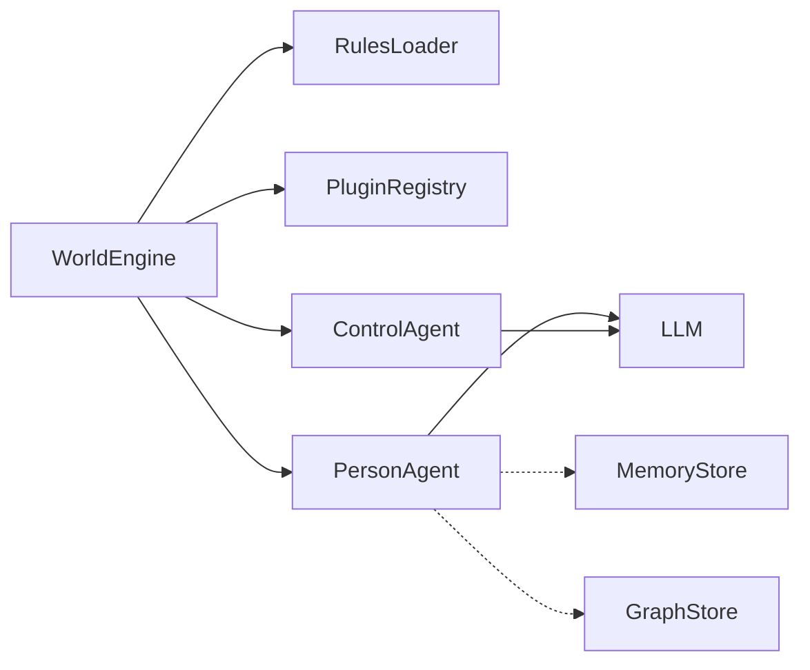

# @worldsim/core

Emulatore di mondo virtuale astratto con agenti LangGraph: motore di simulazione multi-agente per Node.js/TypeScript, modulare tramite plugin, con agenti di governance (**control**) e agenti persona (**person**). L’LLM è integrato tramite un adapter compatibile con le API OpenAI (OpenAI, proxy Anthropic, Ollama, ecc.).

## Caratteristiche principali

- **Simulazione multi-agente** con cicli di ragionamento basati su LangGraph
- **ControlAgent** per governance: monitora le regole e può mettere in pausa o fermare gli agenti
- **PersonAgent** con cicli agentici e controlli di ciclo di vita
- **Sistema di plugin** con hook sugli eventi del mondo e tool registrabili
- **Motore regole** che carica file JSON e, opzionalmente, PDF (estrazione tramite LLM al bootstrap)
- **LLM agnostico** tramite adapter OpenAI-compatible
- **Persistenza opzionale**: senza store configurati, lo stato effimero resta in RAM per la sessione; puoi collegare implementazioni di [`MemoryStore`](src/types/MemoryTypes.ts) e [`GraphStore`](src/types/GraphTypes.ts) per memoria a lungo termine e relazioni tra agenti (vedi [Persistenza e database](#persistenza-e-database))

## Requisiti e installazione

- **Node.js** (versione LTS consigliata)
- **Chiave API** per l’endpoint LLM scelto (es. `OPENAI_API_KEY` per l’API ufficiale OpenAI)

```bash
npm install @worldsim/core
```

Se lavori sul codice sorgente di questo repository:

```bash
npm install
npm run build
```

Variabili ambiente tipiche (file `.env` o shell):

| Variabile | Uso |
|-----------|-----|
| `OPENAI_API_KEY` | Chiamate all’API OpenAI (o servizi compatibili che la richiedono) |
| `REDIS_URL` | Test integrazione Redis (es. `redis://localhost:16379` con lo stack Docker di test) |
| `NEO4J_URI`, `NEO4J_USER`, `NEO4J_PASSWORD` | Test integrazione Neo4j |

## Come si usa la piattaforma (flusso in quattro passi)

1. **Istanzia `WorldEngine`** con configurazione [`WorldConfig`](src/types/WorldTypes.ts): al minimo `llm` (`baseURL`, `apiKey`, `model`); opzionalmente `rulesPath` (glob JSON e/o PDF), `memoryStore`, `graphStore`, `maxTicks`, `tickIntervalMs`, `worldId`.
2. **Registra i plugin** con `world.use(plugin)`: logging, osservabilità, e **tool** esposti agli agenti persona (vedi [Tool e plugin](#tool-e-plugin)).
3. **Aggiungi gli agenti** con `world.addAgent(config)`:
   - `role: "control"`: governance (tool built-in `control_agent`).
   - `role: "person"`: agenti con ciclo LangGraph; possono usare i tool dei plugin tramite `toolNames` (sottoinsieme) o tutti i tool registrati se `toolNames` è omesso; puoi anche passare `tools` direttamente in [`AgentConfig`](src/types/AgentTypes.ts).
4. **Avvia e gestisci il ciclo di vita**: `await world.start()`; l’applicazione host può usare `pauseAgent`, `resumeAgent`, `stopAgent` e ascoltare `world.on("tick", ...)`. Per uno shutdown pulito, chiama `world.stop()` (come nell’esempio con `SIGINT` in [`examples/basic-world/index.ts`](examples/basic-world/index.ts)).

## Architettura (panoramica)



- **Bootstrap**: caricamento regole, hook `onBootstrap` / `onRulesLoaded`, costruzione degli agenti con gli stessi `memoryStore` e `graphStore` opzionali passati nel config del mondo.
- **PersonAgent** usa opzionalmente memoria e grafo per arricchire il contesto e persistere azioni/relazioni tra tick (vedi implementazione in [`PersonAgent`](src/agents/PersonAgent.ts)).

## Tool e plugin

I plugin implementano [`WorldSimPlugin`](src/types/PluginTypes.ts): hook (`onWorldTick`, `onAgentAction`, `onAgentStatusChange`, `onWorldStop`, …) e opzionalmente un array **`tools`**.

Ogni tool è un [`AgentTool`](src/types/PluginTypes.ts): `name`, `description`, `inputSchema` (JSON Schema compatibile), `execute(input, ctx)` dove `ctx` è il [`WorldContext`](src/types/WorldTypes.ts) del mondo.

```typescript
world.use({
  name: "my-plugin",
  version: "1.0.0",
  async onWorldTick(tick, ctx) {
    /* ... */
  },
  async onAgentAction(action, state) {
    return action;
  },
  async onAgentStatusChange(event, oldStatus, newStatus) {
    /* ... */
  },
  async onWorldStop(ctx, events) {
    /* ... */
  },
  tools: [
    {
      name: "my_tool",
      description: "...",
      inputSchema: {},
      execute: async (input, ctx) => {
        /* ... */
      },
    },
  ],
});
```

- **ControlAgent** espone il tool built-in **`control_agent`** per sospendere, riprendere o fermare altri agenti in base alle regole (vedi [`ControlAgent`](src/agents/ControlAgent.ts)).
- **PersonAgent** riceve l’unione dei tool registrati nei plugin (filtrati da `toolNames` se presente) e di eventuali `tools` passati nel config dell’agente.

## Persistenza e database

Non è obbligatorio alcun database: se non passi `memoryStore` né `graphStore` in [`WorldConfig`](src/types/WorldTypes.ts), non c’è persistenza esterna oltre lo stato in memoria durante l’esecuzione.

### Contratti pubblici (package npm)

Il package esporta i tipi delle interfacce da implementare nel tuo backend:

- **`MemoryStore`**: salvataggio e query di [`MemoryEntry`](src/types/MemoryTypes.ts) per agente/tick/tipo (azioni, osservazioni, conversazioni, riflessioni).
- **`GraphStore`**: nodi/relazioni tra agenti modellati come [`Relationship`](src/types/GraphTypes.ts) (forza, metadati, tick di interazione).

Passa una singola istanza per tipo nel costruttore del mondo; [`WorldEngine`](src/engine/WorldEngine.ts) la inoltra a tutti gli agenti che la supportano.

```typescript
const world = new WorldEngine({
  worldId: "my-world",
  llm: {
    baseURL: "https://api.openai.com/v1",
    apiKey: process.env.OPENAI_API_KEY!,
    model: "gpt-4o-mini",
  },
  memoryStore: myMemoryStore,
  graphStore: myGraphStore,
});
```

### Implementazioni di riferimento in questo repository

Le implementazioni **Redis** e **Neo4j** non sono pubblicate come dipendenze del pacchetto `@worldsim/core`; servono come **riferimento** per test di integrazione e come base da copiare o adattare nella tua applicazione:

- [`tests/integration/stores/RedisMemoryStore.ts`](tests/integration/stores/RedisMemoryStore.ts)
- [`tests/integration/stores/Neo4jGraphStore.ts`](tests/integration/stores/Neo4jGraphStore.ts)

Per sviluppo e test senza servizi esterni puoi ispirarti anche agli store in-memory usati nei test:

- [`tests/helpers/InMemoryMemoryStore.ts`](tests/helpers/InMemoryMemoryStore.ts)
- [`tests/helpers/InMemoryGraphStore.ts`](tests/helpers/InMemoryGraphStore.ts)

### Ambiente Docker per test (Redis e Neo4j)

Dalla root del repository:

```bash
npm run test:docker:up    # avvia i servizi definiti in docker-compose.test.yml
npm run test:docker:down  # arresta i servizi
```

Porte e credenziali di esempio (allineate a [`docker-compose.test.yml`](docker-compose.test.yml)):

| Servizio | Porta host | Note |
|----------|------------|------|
| Redis | `16379` → 6379 nel container | URL tipico: `redis://localhost:16379` |
| Neo4j Bolt | `7687` | Utente/password di esempio: `neo4j` / `testpassword` (`NEO4J_AUTH` nel compose) |
| Neo4j Browser | `7474` | Interfaccia HTTP opzionale |

Gli integration test che usano questi servizi si avviano con `npm run test:integration` (richiede `.env` e servizi in esecuzione se non in CI).

## Regole

Le regole vengono caricate al bootstrap da file **JSON** (glob in `rulesPath.json`) e opzionalmente da **PDF** (`rulesPath.pdf`). Per i PDF il contenuto viene estratto tramite LLM ([`PdfRulesParser`](src/rules/PdfRulesParser.ts)); serve quindi un LLM configurato e funzionante per quel passaggio.

Esempio di file JSON:

```json
{
  "version": "1.0.0",
  "name": "My Rules",
  "rules": [
    {
      "id": "rule-001",
      "priority": 1,
      "scope": "all",
      "instruction": "Agents must communicate respectfully.",
      "enforcement": "hard"
    }
  ]
}
```

## Ciclo di vita degli agenti

Gli agenti seguono una macchina a stati: `idle → running → paused → running` (ripresa) oppure `→ stopped` (stato terminale).

```
idle ──start──▶ running ──pause──▶ paused
                  │                   │
                  │──stop──▶ stopped ◀──stop──│
                                      │
                            (terminal, no transitions)
```

L’host può controllare gli agenti con `world.pauseAgent()`, `world.resumeAgent()`, `world.stopAgent()`. I ControlAgent possono applicare le stesse transizioni in autonomia tramite il tool `control_agent`.

## Quick start (codice)

```typescript
import { WorldEngine, ConsoleLoggerPlugin } from "@worldsim/core";

const world = new WorldEngine({
  worldId: "my-world",
  maxTicks: 20,
  tickIntervalMs: 500,
  llm: {
    baseURL: "https://api.openai.com/v1",
    apiKey: process.env.OPENAI_API_KEY!,
    model: "gpt-4o-mini",
  },
  rulesPath: {
    json: ["./rules/*.json"],
  },
});

world.use(ConsoleLoggerPlugin);

world.addAgent({
  id: "governance",
  role: "control",
  name: "Governance Agent",
  systemPrompt: "Monitor rules and enforce compliance.",
});

world.addAgent({
  id: "alice",
  role: "person",
  name: "Alice",
  iterationsPerTick: 3,
  systemPrompt: "You are a curious person who asks questions.",
});

world.addAgent({
  id: "bob",
  role: "person",
  name: "Bob",
  iterationsPerTick: 2,
  systemPrompt: "You are an enthusiastic person who proposes ideas.",
});

await world.start();
```

## Esempio nel repository

È disponibile un esempio più completo in [`examples/basic-world/`](examples/basic-world/) (plugin di osservazione sul ciclo di vita, pause/resume/stop da tick, regole da file).

L’esempio importa `@worldsim/core` come farebbe un progetto che ha installato il pacchetto da npm. **Per eseguirlo in locale senza pubblicare:** dalla root del repo esegui `npm run build`, poi `npm link`; in un progetto Node separato esegui `npm link @worldsim/core`, copia l’esempio (o importa gli stessi moduli), imposta `OPENAI_API_KEY` e avvia lo script con un runner TypeScript (es. `npx tsx index.ts`). In alternativa, dopo `npm install @worldsim/core` nel tuo applicativo, incolla il contenuto dell’esempio nel tuo entrypoint.

## Script npm

| Comando | Descrizione |
|---------|-------------|
| `npm run build` | Build con tsup (CJS + ESM) |
| `npm run dev` | Build in watch mode (tsup) |
| `npm test` | Test unitari (Vitest) |
| `npm run test:watch` | Vitest in modalità watch |
| `npm run test:integration` | Test di integrazione (richiede `.env` e servizi dove necessario) |
| `npm run test:docker:up` | Avvia Redis e Neo4j per i test (`docker-compose.test.yml`) |
| `npm run test:docker:down` | Ferma i container di test |
| `npm run test:prompts` | Valutazioni promptfoo (richiede `.env`) |
| `npm run test:all` | Esegue tutti i test |
| `npm run typecheck` | Controllo tipi TypeScript |
| `npm run lint` | ESLint su `src` |

## Roadmap

Per attività e roadmap di sviluppo dettagliate vedi [`docs/tasks.md`](docs/tasks.md).

## Licenza

MIT
