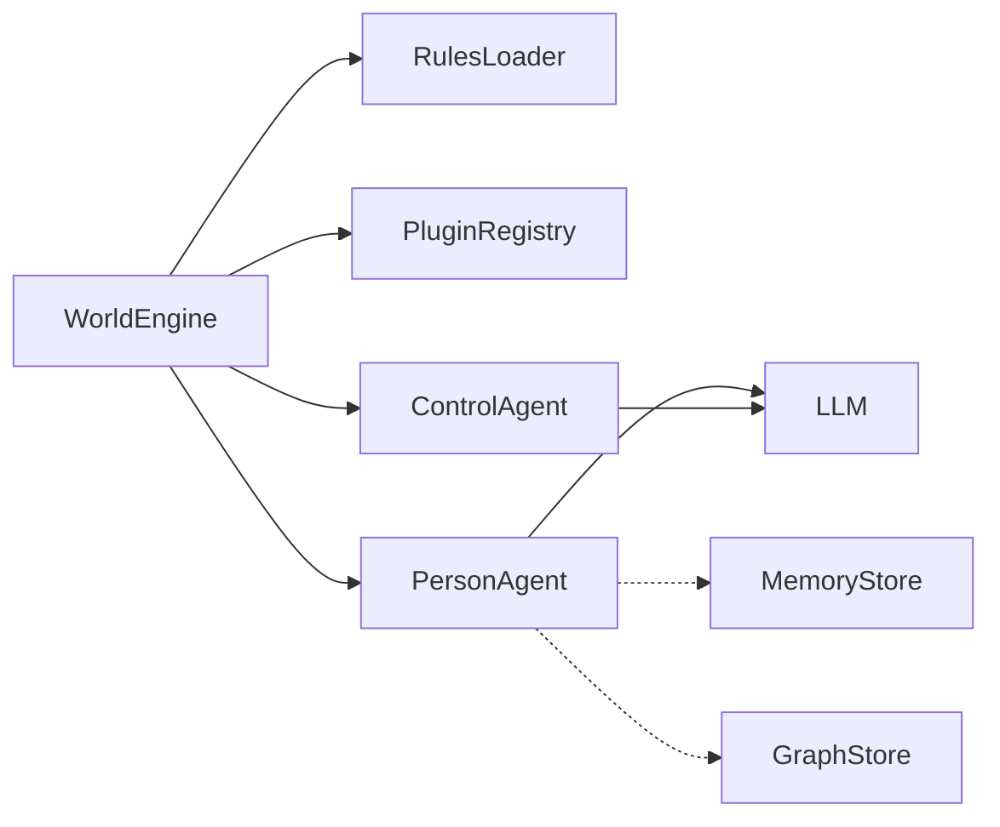

# worldsim

[](https://github.com/francemazzi/worldsim)

**Simulate how communities react to new rules, events, or policies — in TypeScript, in 5 minutes.**

WorldSim is an embeddable multi-agent simulation engine for Node.js. Define agents with distinct personalities, drop in a policy change, and watch coalitions form, conflicts emerge, and consensus build — all powered by LLM reasoning loops.

## Quick Start

```bash
npm install worldsim
OPENAI_API_KEY=sk-... npx worldsim demo
# Open http://localhost:4400 — watch a village react to water rationing
```

Or with Docker:

```bash
OPENAI_API_KEY=sk-... docker compose up
# Open http://localhost:4400
```

## What You Can Simulate

**Community Policy Impact** — 8 villagers face a new water rationing policy. The farmer resists, the mayor defends, the priest mediates, the technologist proposes solutions. Who forms coalitions? Who complies?

**Market Price Shocks** — 10 marketplace agents react when grain prices double overnight. Sellers profit, buyers protest, regulators intervene. Economic reasoning emerges from personality-driven agents.

**Information Cascades** — 12 agents in 4 social groups. A rumor starts with one person. Watch it spread (or not) through the social graph, distorted by each personality along the way.

See [`evaluation/`](evaluation/) for repeatable scenarios with expected behaviors and quality criteria.

## Code Example

```typescript
import { WorldEngine, ConsoleLoggerPlugin, InMemoryMemoryStore, InMemoryGraphStore } from "worldsim";

const world = new WorldEngine({
  worldId: "my-village",
  maxTicks: 20,
  llm: {
    baseURL: "https://api.openai.com/v1",
    apiKey: process.env.OPENAI_API_KEY!,
    model: "gpt-4o-mini",
  },
  memoryStore: new InMemoryMemoryStore(),
  graphStore: new InMemoryGraphStore(),
});

world.use(ConsoleLoggerPlugin);

world.addAgent({
  id: "maria", role: "person", name: "Maria Rossi",
  iterationsPerTick: 2,
  profile: { name: "Maria Rossi", personality: ["practical", "stubborn"], goals: ["Save the harvest"] },
  systemPrompt: "You are Maria, a farmer worried about water rationing.",
});

// Add more agents...

await world.start();
```

## Studio Dashboard

WorldSim includes a built-in web dashboard for real-time simulation monitoring:

```bash
npx worldsim studio
# Open http://localhost:4400
# Optional: --port 5000, --no-open
```

- **Live agent state** — mood, energy, goals, status
- **Event timeline** — every action, every tick
- **Relationship graph** — force-directed visualization of social connections
- **Simulation report** — mood heatmaps, energy charts, action distribution, timeline
- **Multi-world operations** — monitor and compare multiple world runs (city/country shards)

Main sections available in the dashboard:

- **Agents** — inspect profile, current status, goals, mood and energy in real time
- **Timeline** — follow what happens at each tick, with a chronological event stream
- **Perception** — when `interaction.mode === "perception"`: live stimuli on the bus, open topics, ranked percepts and active needs per agent (see [Realistic simulation primitives](#realistic-simulation-primitives))
- **Relationship Graph** — visualize who influences whom and how social ties evolve
- **Report** — review post-run metrics, trends, and behavior distribution

```typescript
import { studioPlugin } from "worldsim";

engine.use(studioPlugin({ engine, port: 4400, memoryStore, graphStore }));
```

### UI Examples

Relationship Graph view (real-time social connection map):


Agent Details view (profile, internal state, and memory timeline):


## Architecture


```mermaid
flowchart LR
  WorldEngine --> RulesLoader
  WorldEngine --> PluginRegistry
  WorldEngine --> PersonAgent
  WorldEngine --> ControlAgent
  PersonAgent --> LLM
  ControlAgent --> LLM
  PersonAgent -.-> MemoryStore
  PersonAgent -.-> GraphStore
```

- **WorldEngine** orchestrates ticks, agents, plugins, and lifecycle
- **PersonAgent** — LangGraph-powered agents with personality, mood, energy, goals, and tool use
- **ControlAgent** — governance agent that monitors rules and can pause/stop violators
- **Plugin system** — hooks on every world event + registerable tools for agents
- **Rules engine** — load from JSON or PDF, with priorities and enforcement levels

## How Simulation Time Works — Ticks

WorldSim is a **discrete-time simulation**: time does not flow continuously, it advances in integer steps called **ticks**. There is no internal notion of "seconds" or "minutes" — a tick is simply a logical unit of simulated time, and _you_ decide what it represents in your scenario (one minute, one hour, one day, one "turn"…).

### The tick loop

Once you call `world.start()`, the engine enters a loop that keeps running until `maxTicks` is reached or `stop()` is called. Every iteration:

1. Increments the world clock (`tick = tick + 1`).
2. Runs one full tick (see pipeline below).
3. Optionally sleeps for `tickIntervalMs` before starting the next one.

Two knobs in `WorldConfig` control the rhythm:

| Option | Meaning | Typical use |
| --- | --- | --- |
| `maxTicks` | How long the simulation runs (default `Infinity`) | `30` for the Villaggio del Sole demo |
| `tickIntervalMs` | Real-time pause between ticks (default `0`) | `2000` in the demo to let a human follow along in the dashboard; `0` in tests/benchmarks to run as fast as possible |

`tickIntervalMs` is **only** wall-clock pacing — it doesn't change what happens inside the simulation. Setting it to `0` just makes the same 30-tick scenario finish faster.

### What happens inside a single tick

Each tick executes a deterministic pipeline (see [`TickOrchestrator.executeTick`](src/engine/internal/TickOrchestrator.ts)):

1. **Clock increment** → `tick`, `context.tickCount`, `messageBus.newTick(tick)`.
2. **`onWorldTick` hook** fires on every registered plugin, then any handler attached via `world.on("tick", …)` runs.
3. **Per-tick resets** — token budget counters, stale conversations cleanup, neighborhood cache.
4. **Active agent selection** — which `PersonAgent`s will actually "think" this tick:
   - Paused/stopped agents are skipped.
   - Agents with pending messages always run (they have a stimulus to react to).
   - `defaultActiveTickRatio` and per-agent schedules (via `ActivityScheduler`) downsample the rest, so you don't pay an LLM call for every agent on every tick.
   - Remaining agents are sorted by number of pending messages (busiest first).
5. **Parallel agent reasoning** — selected agents run their `tick()` through `BatchExecutor`, which enforces `maxConcurrentAgents`. Each agent can internally loop up to `iterationsPerTick` times (recall memory → build context → call LLM → execute tools → emit messages/actions).
6. **Plugin action transforms** — collected `AgentAction`s flow through `onAgentAction` hooks, which can rewrite or annotate them.
7. **Relationship decay** is batched across all active agents.
8. **Control events applied** — pending lifecycle commands (`pause`, `resume`, `stop`) emitted during the tick take effect.
9. **ControlAgent evaluation** — governance agents rule each action as `allowed`, `warned`, or `blocked`.
10. **Action batch hooks + ControlAgent tick** — plugins see the final batch, governance agents run their own reasoning.

Everything temporal in the world is expressed in ticks: memory consolidation windows, relationship strength decay, conversation idle timeout, per-tick token budgets, scheduled control events, and so on.

### Concrete example — Villaggio del Sole

The `community-demo` scenario ([`examples/community-demo/`](examples/community-demo/)) runs 8 villagers + 1 governance agent for **30 ticks**, pacing at **2 seconds per tick**:

```json
{
  "name": "Villaggio del Sole — Razionamento Idrico",
  "maxTicks": 30,
  "tickIntervalMs": 2000,
  "trigger": { "atTick": 10, "announcement": "Il sindaco annuncia il razionamento…" }
}
```

With `iterationsPerTick: 2` on each villager, a single tick can contain up to two internal LLM reasoning steps per agent — enough to read incoming messages, check a tool (`check_weather`, `observe_environment`), decide how to react, and reply.

The scenario uses the tick counter as a **narrative timeline**:

- **Ticks 1–9** — baseline life in the village. Paolo (the journalist) checks the weather forecast, Maria (the farmer) observes her well drying up, gossip starts spreading through Giuseppe's bakery.
- **Tick 10** — the `on("tick", …)` handler fires the policy trigger:

  ```typescript
  world.on("tick", (tick) => {
    if (tick === triggerTick && announcement) {
      console.log(`POLICY TRIGGER — Tick ${tick}`);
    }
  });
  ```

  The water-rationing rules become active and the governance agent starts enforcing them.
- **Ticks 11–30** — coalitions form, resistance emerges, Sara proposes rainwater harvesting, Padre Lorenzo mediates. Every action, every message, every mood change is stamped with the tick it happened on, which is exactly what the Studio timeline and final report replay.

### Concrete example — lifecycle control

The `basic-world` example ([`examples/basic-world/index.ts`](examples/basic-world/index.ts)) shows ticks as **injection points** for host-driven events:

```typescript
world.on("tick", (tick) => {
  if (tick === 5)  world.pauseAgent("person-2", "Fase di test");
  if (tick === 8)  world.resumeAgent("person-2");
  if (tick === 15) world.stopAgent("person-4", "Missione completata");
});
```

Because the tick loop is the single clock of the simulation, scheduling "at tick N do X" is trivial — no cron, no timers, no race conditions. You can inject policy changes, simulated crises (a price shock, a rumor, a blackout) or agent lifecycle events deterministically at specific ticks, and the same scenario will replay identically if you fix the LLM seed.

### Pause, resume, stop

- `pause()` sets status to `paused` and the `while` loop exits cleanly; the clock freezes at the current tick.
- `resume()` re-enters `runLoop()` from the same tick — no state is lost.
- `stop()` ends the loop, fires the `onWorldStop` plugin hook with the full event log, and lets you collect the final report.

### Choosing `maxTicks` and `tickIntervalMs`

| Use case | `maxTicks` | `tickIntervalMs` | Notes |
| --- | --- | --- | --- |
| Live demo in the Studio dashboard | 20–50 | 1000–2000 | Human-watchable pace |
| Automated evaluation / CI | 20–100 | `0` | Run at full speed |
| Benchmarks | 100+ | `0` | Measure throughput |
| Long-horizon emergent dynamics | 200+ | `0` or small | Combine with `defaultActiveTickRatio` < 1 to keep LLM costs bounded |

If you're unsure, start with the community demo's numbers (`maxTicks: 30`, `tickIntervalMs: 2000`) and tune from there.

## Phones, Calls & Movement

Agents that own the right assets can text each other, place phone calls (their dialog is transcribed as a chat), and move around the world under rules you control.

```typescript
import {
  WorldEngine,
  InMemoryAssetStore,
  PhonePlugin,
  MovementPlugin,
  LocationIndex,
  createPhoneAsset,
  defaultMovementPolicy,
} from "worldsim";

const assetStore = new InMemoryAssetStore();
const locationIndex = new LocationIndex();

const engine = new WorldEngine({
  /* ...llm, stores... */
  assetStore,
  // Default policy allows walking within 1.5 km, requires a vehicle beyond.
  walkingRadiusMeters: 1500,
  // Or replace with your own rules (health data, public transit, licenses, …):
  // movementPolicy: (req) => ({ allowed: req.distanceMeters < 500, mode: "walking" }),
});

engine.use(new MovementPlugin(locationIndex));
engine.use(
  new PhonePlugin({
    assetStore,
    messageBus: engine.getMessageBus(),
    conversationManager: engine.getConversationManager(),
  }),
);

// Give Alice a phone and a car so she can text, call, and drive long distances.
await assetStore.addAssets([
  createPhoneAsset({ agentId: "alice", phoneNumber: "+39 111" }),
  { id: "car-alice", type: "vehicle", name: "Panda", owner: "alice", ownerType: "agent" },
]);
```

Once their phone is registered, agents automatically get four tools: `send_sms`, `start_call`, `speak_in_call`, `hang_up`. Call transcripts land on the bus as regular `Message`s with `type: "call_transcript"` and `metadata.callId`, so UIs and the reporting plugin can render them as chat turns.

Movement is governed by a `MovementPolicy` — a pure function that receives `{ agentId, from, to, distanceMeters, assets, profile }` and returns `{ allowed, mode?, reason? }`. Swap `defaultMovementPolicy` for anything you need: public transit, HealthKit steps, weather, curfews. WorldSim stays agnostic.

## Groups & Gatherings — Beyond Egocentric Agents

Out of the box, each `PersonAgent` reasons in the first person. Calls, SMS, conversations at venues and bilateral relationships already let agents coordinate ad-hoc, but there was no structured concept of "a group of N agents with a stable identity" or "a scheduled multi-agent event". From `1.3.x` WorldSim ships two minimal, **unopinionated** core primitives to fill this gap:

- **`Group`** — an arbitrary, explicitly-declared formal collection of agents with a stable `id`. Different from `Household` (cohabitation + shared assets) and `NeighborhoodManager` (geographic clustering + relationship decay). The installer gives a Group its meaning via the free-form `kind` field: `"book-club"`, `"party-crew"`, `"protest-org"`, `"research-team"`…
- **`Gathering`** — a scheduled moment in time at an optional venue, with a participant list and RSVP state machine (`invited` → `accepted`/`declined` → `attended`/`no_show`). Lifecycle (`scheduled` → `in_progress` → `ended` / `cancelled`) is driven mechanically by `advanceLifecycle(tick)` — the core engine fires no opinionated events on its own.

The stores are plain interfaces with zero-dependency in-memory implementations. Wire them on `WorldConfig` just like `assetStore` or `graphStore`:

```typescript
import {
  WorldEngine,
  InMemoryGroupStore,
  InMemoryGatheringStore,
} from "worldsim";

const groupStore = new InMemoryGroupStore();
const gatheringStore = new InMemoryGatheringStore();

const world = new WorldEngine({
  worldId: "my-village",
  llm: { /* … */ },
  groupStore,
  gatheringStore,
});
```

**By design, WorldSim ships no built-in tools on top of these stores.** No `organize_party`, no `invite_to_gathering`, no `rsvp` in the core. You compose your own plugin — the vocabulary, the tool names, the side-effects (phone notifications, movement to the venue, mood boosts on attendance, capacity checks) are *your* simulation's story to tell. Minimal sketch:

```typescript
import type { WorldSimPlugin, AgentTool } from "worldsim";

function partyPlugin(opts: { groupStore, gatheringStore }): WorldSimPlugin {
  const tools: AgentTool[] = [
    {
      name: "invite_friends_to_bar",
      description: "Organizza una serata al bar con amici",
      inputSchema: { /* friendIds, venueId, atTick */ },
      async execute(input, ctx) {
        const organizer = ctx.metadata?.currentAgentId as string;
        await opts.groupStore.addGroup({
          id: `grp_${crypto.randomUUID()}`,
          kind: "party-crew",
          members: [organizer, ...input.friendIds],
          owner: organizer,
          createdAtTick: ctx.tickCount,
        });
        await opts.gatheringStore.addGathering({
          id: `gth_${crypto.randomUUID()}`,
          kind: "party",
          scheduledTick: input.atTick,
          venueId: input.venueId,
          organizer,
          participants: [
            { agentId: organizer, rsvp: "accepted" },
            ...input.friendIds.map(id => ({ agentId: id, rsvp: "invited" })),
          ],
          status: "scheduled",
          createdAtTick: ctx.tickCount,
        });
        return { ok: true };
      },
    },
    // accept_invite, list_my_upcoming_gatherings, …
  ];

  return {
    name: "party-plugin",
    version: "0.1.0",
    tools,
    async onWorldTick(tick) {
      const changed = await opts.gatheringStore.advanceLifecycle(tick);
      for (const g of changed) {
        // When a gathering flips to "in_progress", make accepted participants
        // converge at the venue (delegate to MovementPlugin / PhonePlugin / …).
      }
    },
  };
}
```

This way worldsim stays neutral and the *package installer* decides what a "gathering" means in their simulation — a wedding, a town assembly, a protest, a book club night, a birthday. Types available: `Group`, `Gathering`, `GatheringParticipant`, `RsvpState`, `GatheringStatus`, `GatheringQuery`, `GroupStore`, `GatheringStore`.

## Realistic simulation primitives

WorldSim ships an opt-in stack of physics-aware primitives that make agent interactions look like real life: **agents only know what their senses pick up**, **salience drives whether they react**, and a topic tracker keeps replies coherent on the same thread. Activation is one switch on `WorldConfig`:

```typescript
const world = new WorldEngine({
  /* ...standard config... */
  interaction: {
    mode: "perception",            // "legacy" (default) | "perception"
    defaultSenses: [
      { channel: "sound", radiusKm: 0.05 },
      { channel: "sight", radiusKm: 0.03 },
      { channel: "language", languages: ["it"] },
    ],
    disableBroadcastFallback: true,    // strict: drop speech nobody hears
    topicWindowTicks: 5,               // how long a topic stays "open"
    defaultNeedsTemplate: "humanBasic", // auto-populates hunger/thirst/fatigue/social
  },
});

// Non-agent entities (animals, objects, signals) participate in perception too:
world.addEntity({
  id: "bell-1",
  kind: "object",
  position: { latitude: 45.0, longitude: 9.0 },
  emitters: [{
    kind: "sound", channel: "sound",
    intensity: 0.5, rangeKm: 0.05,
    payload: { sound: "ding" },
  }],
});
```

What you get when `mode: "perception"` is on:

- **`Stimulus` + `StimulusBus`** — every `speak`, every entity emitter (a fountain's smell, a dog's bark, a radio signal) becomes a tick-bounded fact on the bus.
- **`PerceptionEngine`** — per-channel perception with linear distance attenuation, configurable `perceptionFloor`, language gating for intelligibility, optional line-of-sight filters.
- **`AttentionPolicy`** — multi-factor salience scoring (intensity, novelty, needs/goals match, relationship strength, interests, recency) with a budget and threshold. Below threshold = no forced reply.
- **`TopicTracker`** — clusters causal chains and co-participation into topics; the agent prompt surfaces the dominant topic so replies stay threaded.
- **`NeedsTracker`** — drives (hunger, fatigue, fear, social…) with decay/regen per tick. Built-in `humanBasic` and `animalBasic` templates, or pass a custom `NeedsState` per agent.
- **`EntityRegistry` + `AffordanceResolver`** — non-agent entities (animals, objects, signals) participate in the perception loop and expose affordances (`eat`, `sit`, `ride`, …) only when actually perceived.
- **New `"perceive"` action** — agents can passively acknowledge a stimulus without speaking. No more chatty agents replying just to fill silence.

How the data lands inside the LLM prompt:

- A `--- PERCEZIONI ---` section lists the *attended* percepts in salience order (with distance, intelligibility and topic id), replacing the legacy "voice" bucket.
- An optional `--- FILO DISCORSIVO ---` block reminds the agent of the topic they are engaged in.
- An optional `--- BISOGNI ATTIVI ---` block surfaces active needs above their `activationThreshold`. Critical needs also bypass the idle short-circuit.
- The action union widens to include `"perceive"` so the LLM can choose silence.

Strict mode (`disableBroadcastFallback: true`) drops speech that no one hears, just like real life. Default `legacy` mode is bit-for-bit identical to previous releases — nothing changes unless you opt in.

The Studio dashboard ships a dedicated **Perception** page that reads `/api/perception/{status, stimuli, topics, percepts/:id, needs/:id}` so you can debug, tick by tick, what each agent actually heard, which topics are open, and how their needs evolve.

See `evaluation/scenarios/village-realistic`, `enclosure-animals`, and `office-floor` for runnable end-to-end scenarios, and `tests/perception/fullstack.test.ts` for the integration test that exercises the full pipeline.

## Creating Your Own Scenario

A WorldSim scenario is just a folder with four ingredients. The simplest way to start is to copy [`evaluation/scenarios/water-rationing/`](evaluation/scenarios/water-rationing/) and adapt it.

```
my-scenario/
├── scenario.json          # agents + trigger + timing
├── rules/
│   ├── base-rules.json    # rules active from tick 1
│   └── trigger-rules.json # rules loaded when the shock fires
├── expected.md            # (optional) qualitative rubric for evaluation
└── index.ts               # runner that wires engine + plugins
```

### 1. `scenario.json` — the "script"

A declarative file with timing, the policy trigger, and the cast:

| Field | Purpose |
| --- | --- |
| `name`, `description` | Human-readable identity of the run |
| `maxTicks` | How long the simulation runs (e.g. `30`) |
| `tickIntervalMs` | Wall-clock pause between ticks (`2000` for live demo, `0` for tests) |
| `trigger.atTick` | When the disruptive event fires |
| `trigger.addRules` | Relative paths of rule files to load at the trigger |
| `trigger.announcement` | Broadcast text delivered to every agent |
| `agents[]` | The list of actors |

Each agent declares its identity and — crucially — its personality:

```jsonc
{
  "id": "maria",
  "role": "person",            // "person" | "control" (governance)
  "name": "Maria Rossi",
  "iterationsPerTick": 2,      // internal LLM reasoning steps per tick
  "systemPrompt": "Sei Maria, contadina di 52 anni, pratica e testarda…",
  "profile": {
    "age": 52,
    "profession": "Contadina",
    "personality": ["pratica", "testarda", "generosa"],
    "goals": ["Salvare il raccolto", "Proteggere la famiglia"],
    "backstory": "…",
    "skills": ["farming", "cooking"]
  }
}
```

The `systemPrompt` is where simulation quality lives: the more specific it is about tone, values and internal conflicts, the longer the agent stays in character across the run.

### 2. `rules/*.json` — the normative fabric

Rules are interpreted by the `RuleEngine` and enforced by the governance `ControlAgent`:

```json
{
  "version": "1.0",
  "name": "Village rules",
  "rules": [
    {
      "id": "rispetto",
      "priority": 1,
      "scope": "all",
      "instruction": "All members must communicate respectfully. Insults are forbidden.",
      "enforcement": "hard"
    }
  ]
}
```

- `scope` — `"all"` (everyone), `"person"` (only human agents), `"control"` (only governance agents).
- `enforcement` — `"hard"` blocks the action, `"soft"` only warns.
- `priority` — lower number = evaluated first.
- `instruction` — free text passed to the ControlAgent as judgement context.

The convention across the existing scenarios is two files: a **base** rulebook loaded from tick 1 (e.g. `community-rules.json`) and a **trigger** rulebook loaded at `trigger.atTick` via `trigger.addRules` (e.g. `water-rationing.json`).

### 3. `expected.md` — the qualitative rubric (optional)

Not required to run the simulation, but essential when you want to *judge* its output. It lists, per agent, what the run should look like, the expected dynamics over time, and the failure modes that signal a broken scenario. Together with [`evaluation/criteria.md`](evaluation/criteria.md) it forms the rubric used to score simulation reports.

### 4. `index.ts` — the runner

The runner wires the scenario into a `WorldEngine`, registers plugins and fires the trigger. A minimal template:

```typescript
import {
  WorldEngine,
  ConsoleLoggerPlugin,
  InMemoryMemoryStore,
  InMemoryGraphStore,
  studioPlugin,
} from "worldsim";
import { reportGeneratorPlugin } from "worldsim/plugins";
import { readFileSync } from "node:fs";

const scenario = JSON.parse(readFileSync("scenario.json", "utf-8"));

const world = new WorldEngine({
  worldId: scenario.name,
  maxTicks: scenario.maxTicks,
  tickIntervalMs: scenario.tickIntervalMs,
  llm: {
    baseURL: "https://api.openai.com/v1",
    apiKey: process.env.OPENAI_API_KEY!,
    model: "gpt-4o-mini",
  },
  rulesPath: { json: ["rules/community-rules.json"] },
  memoryStore: new InMemoryMemoryStore(),
  graphStore: new InMemoryGraphStore(),
});

world.use(ConsoleLoggerPlugin);

const report = reportGeneratorPlugin({ engine: world });
world.use(report.plugin);
world.use(studioPlugin({ engine: world, port: 4400, open: true }));

for (const agent of scenario.agents) world.addAgent(agent);

world.on("tick", (tick) => {
  if (tick === scenario.trigger.atTick) {
    report.recordPolicyTrigger(tick, scenario.trigger.announcement);
  }
});

await world.start();
```

Calling `report.recordPolicyTrigger(tick, announcement)` at the trigger tick is what lets the report build the `shock` section (pre/post stats, deltas, `recoveryTicks`).

### Optional building blocks

Add these only when the scenario needs them:

| If you want... | Add |
| --- | --- |
| Phones / SMS / calls between agents | `PhonePlugin` + `InMemoryAssetStore` + `createPhoneAsset` |
| Physical movement across the world | `MovementPlugin` + `LocationIndex` + `MovementPolicy` |
| Realistic perception (senses, attention, topics, needs) | `interaction: { mode: "perception", defaultSenses: [...] }` on `WorldConfig` (see [Realistic simulation primitives](#realistic-simulation-primitives)) |
| Non-agent entities (animals, objects, signals) | `world.addEntity({ id, kind, position, emitters })` (requires `interaction.mode === "perception"`) |
| Vital skills (farming, cooking…) | `LifeSkillsPlugin([...])` |
| Real-world tools (weather, environment) | `RealWorldToolsPlugin({ dataSources })` |
| Live dashboard in the browser | `studioPlugin({ engine, port: 4400 })` |
| Final report + sociological analysis | `reportGeneratorPlugin({ engine })` |
| Shock analysis in the report | `report.recordPolicyTrigger(tick, msg)` |
| Reproducible evaluation | Drop the scenario under `evaluation/scenarios/<name>/` and run `run-evaluation.ts` |

### What you get at the end

`reportGeneratorPlugin` produces a `SimulationReport` — fully JSON-serializable, consumable from the Studio dashboard and exportable to CSV — with:

- `summary`, `timeline`, per-agent trajectories (`mood`, `energy`, status changes).
- `relationships[]` with initial/final strength and per-tick snapshots.
- `metrics` (speaks, observations, tool calls, tokens, cost).
- `network` — degree / betweenness / eigenvector centrality, density over time, communities, reciprocity, homophily.
- `dialogue` — who-talks-to-whom matrix, voice Gini, response rate, message-length stats.
- `shock` (when `recordPolicyTrigger` is called) — pre/post windows, deltas, `recoveryTicks`.
- `archetypes` — each agent classified as `compliant | skeptic | resistant | apathetic` with rationale, plus emotional contagion and mood variance per tick.
- `narrative` (opt-in, LLM cost) — global story arc, per-agent arcs, emblematic quotes. Triggered via `POST /api/reports/:runId/narrative`.

### Recommended workflow

1. **Copy a template** — duplicate `evaluation/scenarios/water-rationing/` as `evaluation/scenarios/my-case/`.
2. **Rewrite `scenario.json`** with at least 3 personalities in *tension* (otherwise "immediate consensus" kills the narrative).
3. **Define the rules**: a few soft rules as baseline + one hard rule as the trigger shock.
4. **Write `expected.md`** — even just for yourself, it makes it obvious when a run is broken.
5. **Run it live** with `tickIntervalMs: 2000` and the Studio dashboard to watch dynamics unfold.
6. **Run it headless** (`tickIntervalMs: 0`) and compare `evaluation/results/<name>.json` against `expected.md` using [`criteria.md`](evaluation/criteria.md).
7. **Iterate on the system prompts** — ~90% of simulation quality comes from prompt specificity and the clarity of the trigger announcement.

### Common pitfalls to avoid

- **Homogeneous cast** → vary age, profession, personality, goals. The `network.homophily` score in the report will flag this.
- **Ignored trigger** → the announcement must be explicit and at least one rule needs `enforcement: "hard"` with a governance agent (`role: "control"`) to enforce it.
- **Monologues** → give agents backstories that *connect* them, and prompt them to address others by name.
- **Language drift** → if the scenario is in Italian, insist in the prompt: "parli sempre in italiano".
- **No narrative arc** → 30 ticks with a mid-run trigger is the minimum to get pre/reaction/coalition/resolution; below 15 ticks everything collapses.

## Key Capabilities

| Feature | Description |
| ------- | ----------- |
| **LLM-agnostic** | OpenAI, Anthropic proxies, Ollama — anything OpenAI-compatible |
| **Personality system** | Mood, energy, goals, beliefs, knowledge per agent |
| **Realistic perception** | Opt-in stimulus/perception/attention/topic/needs stack for physics-aware agent interactions |
| **Social dynamics** | Relationship tracking with strength decay, neighborhoods |
| **Rule enforcement** | Hard/soft rules, governance agent with autonomous control |
| **Scalability** | 1000+ agents via concurrency caps, activity scheduling, token budgets |
| **Zero-config persistence** | In-memory by default; plug in Redis, Neo4j, PostgreSQL for production |
| **Real-time streaming** | Socket.IO events for live dashboards |
| **Simulation reports** | Auto-generated analysis with mood heatmaps and action metrics |

## Documentation

- [Architecture & internals](docs/architecture.md)
- [Persistence & databases](docs/persistence.md)
- [Scaling to production](docs/scaling.md)
- [Plugin authoring guide](docs/plugins.md)
- [Evaluation scenarios](evaluation/README.md)
- [Development roadmap](docs/ROADMAP.md)

## Contributing

See [CONTRIBUTING.md](CONTRIBUTING.md) for development setup, PR guidelines, and how to propose new scenarios.

## License

MIT
