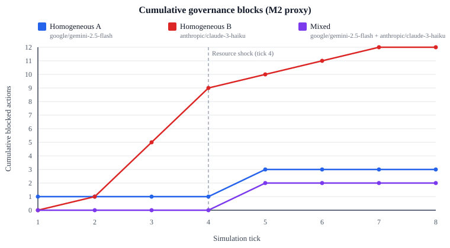

# worldsim

[](https://github.com/francemazzi/worldsim)
[](https://francemazzi.github.io/worldsim/)

**Simulate how communities react to new rules, events, or policies — in TypeScript, in 5 minutes.**

WorldSim is an embeddable multi-agent simulation engine for Node.js. You define a world, add agents with personalities and goals, optionally load rules or a crisis trigger, then let the engine advance tick by tick while agents reason, talk, use tools, build relationships and produce a report.

## Documentation

**Full documentation:** [https://francemazzi.github.io/worldsim/](https://francemazzi.github.io/worldsim/)

| Topic | Link |
| --- | --- |
| Quick Start | [Getting Started](https://francemazzi.github.io/worldsim/guide/getting-started) |
| Architecture | [Architecture & Internals](https://francemazzi.github.io/worldsim/architecture) |
| Perception layer | [Realistic Simulation Primitives](https://francemazzi.github.io/worldsim/perception) |
| Creating scenarios | [Creating Scenarios](https://francemazzi.github.io/worldsim/guide/creating-scenarios) |
| Scaling & production | [Scaling](https://francemazzi.github.io/worldsim/scaling) |
| Plugin authoring | [Plugins](https://francemazzi.github.io/worldsim/plugins) |

## Quick Start

```bash
npm install worldsim
OPENAI_API_KEY=sk-... npx worldsim demo
# Open http://localhost:4400 — watch a village react to water rationing
```

Or launch the Studio dashboard directly:

```bash
npx worldsim studio
```

## Key Capabilities

| Feature | Description |
| ------- | ----------- |
| **LLM-agnostic** | OpenAI, Anthropic proxies, Ollama — anything OpenAI-compatible |
| **Personality system** | Mood, energy, goals, beliefs, knowledge per agent |
| **Realistic perception** | Opt-in stimulus/perception/attention/topic/needs stack for physics-aware agent interactions |
| **Social dynamics** | Relationship tracking with strength decay, neighborhoods |
| **Rule enforcement** | Hard/soft rules, governance agent with autonomous control |
| **Scalability** | 1000+ agents via concurrency caps, activity scheduling, token budgets |
| **Zero-config persistence** | In-memory by default; plug in Redis, Neo4j, PostgreSQL for production |
| **Real-time streaming** | Socket.IO events for live dashboards |
| **Simulation reports** | Auto-generated analysis with mood heatmaps and action metrics |

## Cross-vendor divergence (Emergence World-inspired)

WorldSim can run scaled-down cross-LLM studies inspired by the [Emergence World](https://arxiv.org/abs/2606.08367) platform. The integration test `npm run test:integration:emergence` spins up three micro-worlds (homogeneous model A, homogeneous model B, mixed population) under identical constitutional rules and a mid-run resource shock.

The chart below plots **cumulative governance blocks** (an M2 safety proxy) over 8 simulation ticks. Identical starting conditions produce divergent enforcement trajectories across model vendors — the same qualitative pattern Emergence World reports in Figure 4 (M2: Safety & Public Order).



> Inspired by Figure 4 (M2: Safety & Public Order) in *Emergence World: A Platform for Evaluating Long-Horizon Multi-Agent Autonomy* (Kokku et al., [arXiv:2606.08367](https://arxiv.org/abs/2606.08367), Emergence AI, 2026).

This is an **illustrative micro-replica** (4 person agents, 8 ticks, single run). It is not equivalent to the original 15-day study with 10 agents and five parallel worlds. To reproduce or regenerate the chart:

```bash
npm run test:integration:emergence   # full integration suite (requires OPENROUTER_API_KEY)
npm run emergence:chart              # regenerate docs/public/emergence-m2-example.{json,svg}
npm run emergence:chart:render       # render SVG from committed JSON (no API key)
```

See the [Getting Started guide](https://francemazzi.github.io/worldsim/guide/getting-started#emergence-style-cross-vendor-integration-test) for environment variables and setup.

## Contributing

See [CONTRIBUTING.md](CONTRIBUTING.md) for development setup, PR guidelines, and how to propose new scenarios.

## License

MIT
