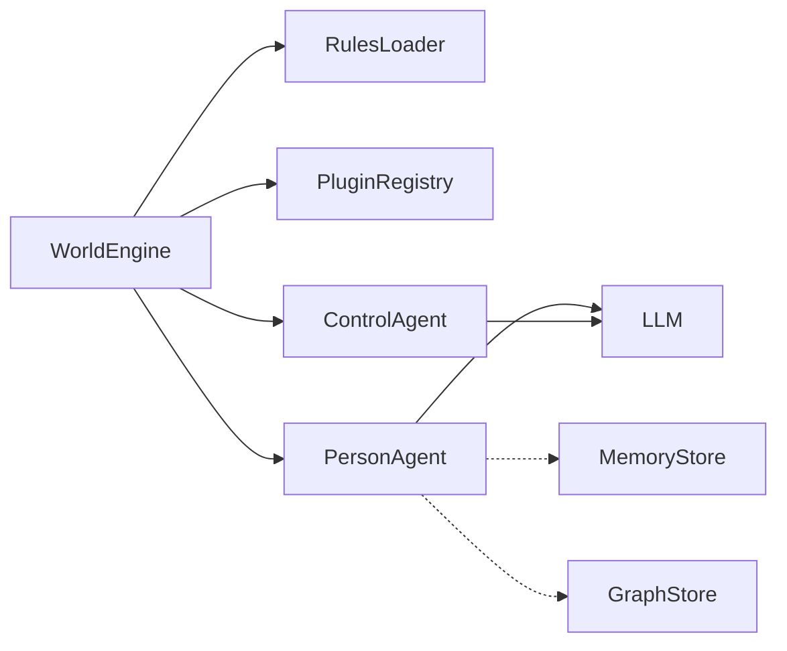

# Architecture & Internals

This document describes the internal architecture of `worldsim`: how the engine orchestrates agents, how agents are structured, and how the subsystems (plugins, rules, messaging, memory) fit together.



---

## WorldEngine orchestration flow

`WorldEngine` (in [`../src/engine/WorldEngine.ts`](../src/engine/WorldEngine.ts)) is the top-level entry point. Its lifecycle has three phases:

1. **Bootstrap** (`WorldBootstrapper`) — loads rules via `RulesLoader`, fires `onBootstrap` and `onRulesLoaded` plugin hooks, auto-composes `BrainMemory` when vector/persistence stores are provided, instantiates all `PersonAgent` and `ControlAgent` instances from pending configs, assigns plugin tools to person agents, and starts every agent.
2. **Tick loop** (`TickOrchestrator.runLoop`) — increments the world clock, executes one tick per iteration, and optionally sleeps for `tickIntervalMs` between ticks. The loop runs until `maxTicks` is reached or `stop()` is called.
3. **Stop** (`WorldLifecycle`) — sets status to `"stopped"` and fires the `onWorldStop` plugin hook with the full event log.

The engine also exposes lifecycle methods for individual agents: `pauseAgent`, `resumeAgent`, `stopAgent`. Each emits an `onAgentStatusChange` plugin hook.

Source: [`../src/engine/internal/WorldBootstrapper.ts`](../src/engine/internal/WorldBootstrapper.ts), [`../src/engine/internal/WorldLifecycle.ts`](../src/engine/internal/WorldLifecycle.ts)

---

## TickOrchestrator: per-tick execution

Each tick in [`TickOrchestrator.executeTick()`](../src/engine/internal/TickOrchestrator.ts) proceeds through these steps:

1. **Increment clock** and update context (`tickCount`, `messageBus.newTick`).
2. **Fire `onWorldTick`** plugin hook and call registered tick handlers.
3. **Reset per-tick state** — token budget counters, stale conversations, neighborhood cache.
4. **Filter active person agents** — skips non-running agents, always includes agents with pending messages, applies `defaultActiveTickRatio` via `ActivityScheduler` for agents without their own schedule. Sorts by pending message count (more messages = higher priority).
5. **Execute person agents** — wraps each agent's `tick()` call in a task and passes all tasks to `BatchExecutor.executeSettled()` for concurrency-limited parallel execution. Failed agents are logged, not fatal.
6. **Batch decay/prune relationships** via `NeighborhoodManager` for all active agents.
7. **Apply control events** — `ControlEventApplier` processes any pending agent lifecycle commands (pause, resume, stop) emitted during the tick.
8. **ControlAgent evaluation** — if control agents exist and there were actions, each active `ControlAgent` evaluates the collected actions (subject to `controlSamplingRate`). Verdicts are `"blocked"`, `"warned"`, or `"allowed"`.
9. **Run action plugin hooks** — calls `onAgentActionsBatch` for batch plugins, `onAgentAction` for per-action plugins.
10. **Tick control agents** — each active `ControlAgent` runs its own `tick()` for autonomous governance actions.

---

## Agent system

### BaseAgent

[`BaseAgent`](../src/agents/BaseAgent.ts) is the abstract base class for all agents. It provides:

- **Lifecycle** via `AgentLifecycle` (start, pause, resume, stop).
- **Internal state** — mood, energy, goals, beliefs, knowledge, custom data.
- **System prompt builder** — assembles profile, state, memories, relationships, personality enforcement, social dynamics, and rules into a single prompt.
- **Tick gating** — `shouldSkipTick()` checks activity schedule and token budget before executing.
- **Message primitives** — `emit()` broadcasts to all agents, `onMessage()` subscribes to directed/broadcast messages.

### PersonAgent

`PersonAgent` (in [`../src/agents/PersonAgent.ts`](../src/agents/PersonAgent.ts)) extends `BaseAgent` and implements the agentic loop via LangGraph:

- Each `tick()` runs a multi-step loop: recall memories, build context, call the LLM, execute tool calls, persist new memories, update relationships, and produce `AgentAction` results.
- Tools are injected by the bootstrapper from the `PluginRegistry`. Agents can be given access to all tools or a specific subset via `toolNames` in their config.
- Supports a "light" LLM tier (`llmTier: "light"`) for cheaper agents that use a secondary model.

### ControlAgent

`ControlAgent` (in [`../src/agents/ControlAgent.ts`](../src/agents/ControlAgent.ts)) extends `BaseAgent` with governance responsibilities:

- At bootstrap, it ingests all loaded rules into its cognitive context.
- `evaluateActions()` reviews `AgentAction[]` against the rules, producing verdicts (`allowed`, `warned`, `blocked`).
- Has a built-in `control_agent` tool that can pause/resume/stop other agents autonomously.
- Supports `controlSamplingRate` to evaluate only a fraction of actions at scale.

---

## Plugin system

Plugins implement the `WorldSimPlugin` interface defined in [`../src/types/PluginTypes.ts`](../src/types/PluginTypes.ts). Registration is done via `engine.use(plugin)`, which delegates to `PluginRegistry`.

### Available hooks

| Hook | Signature | When |
|------|-----------|------|
| `onBootstrap` | `(ctx, rules) => Promise<void>` | After rules are loaded, before agents start |
| `onWorldTick` | `(tick, ctx) => Promise<void>` | Start of every tick |
| `onAgentAction` | `(action, state) => Promise<AgentAction>` | Per-action (can transform) |
| `onAgentActionsBatch` | `(actions, ctx) => Promise<void>` | Once per tick with all actions (mutual exclusive with `onAgentAction` per plugin) |
| `onRulesLoaded` | `(rules) => Promise<void>` | After rules parsing completes |
| `onWorldStop` | `(ctx, events) => Promise<void>` | When the engine stops |
| `onAgentStatusChange` | `(event, oldStatus, newStatus) => Promise<void>` | On any agent lifecycle transition |

### Tool registration

Plugins expose tools via the `tools` array. Each tool follows the `AgentTool` interface: `name`, `description`, `inputSchema`, and an async `execute(input, ctx)` function.

### Parallel flag

When `parallel: true` is set on a plugin, its hooks run concurrently with other parallel plugins. Sequential plugins (the default) run in registration order.

Source: [`../src/plugins/PluginRegistry.ts`](../src/plugins/PluginRegistry.ts)

---

## Rules engine

Rules are loaded at bootstrap by [`RulesLoader`](../src/rules/RulesLoader.ts) from two sources:

- **JSON files** — parsed by `JsonRulesParser`, validated against a Zod schema (`RulesSchema`).
- **PDF files** — text-extracted by `PdfRulesParser`, then structured into rules via an LLM call.

Each `Rule` has:

| Field | Type | Description |
|-------|------|-------------|
| `id` | `string` | Unique identifier |
| `priority` | `number` | Lower = higher priority (rules are sorted by this) |
| `scope` | `"world" \| "control" \| "person" \| "all"` | Which agents see this rule |
| `enforcement` | `"hard" \| "soft"` | Hard rules are strict; soft rules are guidance |
| `instruction` | `string` | The rule text injected into agent prompts |
| `condition` | `string?` | Optional condition for contextual rules |

Rules are injected into agent system prompts as `[HARD] ...` or `[SOFT] ...` lines, and the `ControlAgent` evaluates actions against them.

Source: [`../src/types/RulesTypes.ts`](../src/types/RulesTypes.ts), [`../src/rules/RulesSchema.ts`](../src/rules/RulesSchema.ts)

---

## Messaging

### MessageBus

[`MessageBus`](../src/messaging/MessageBus.ts) is the in-memory inter-agent messaging backbone. It supports:

- **Directed messages** — `publish({ to: "agent-id", ... })` delivers to a specific agent.
- **Broadcast** — `broadcast(msg)` sets `to: "*"` and delivers to all subscribers.
- **Group publish** — `publishToGroup(msg, recipientIds)` creates one message per recipient.
- **Tick-scoped storage** — messages are indexed by tick and recipient for O(1) lookup. Old ticks are cleaned up automatically.

### ConversationManager

[`ConversationManager`](../src/messaging/ConversationManager.ts) adds structured turn-taking on top of the message bus:

- Start a conversation with `startConversation(initiator, participants, topic)`.
- Round-robin speaker rotation via `advanceTurn()`.
- `canSpeak(agentId)` gates agent speech to prevent out-of-turn talking.
- Stale conversations are auto-cleaned after a configurable number of idle ticks.

### Proximity-based messaging

When `defaultBroadcastRadius` is configured (in km), agents without explicit recipients use spatial proximity instead of global broadcast. Agents without a location fall back to broadcast. The `LocationIndex` tracks agent positions for distance calculations.

---

## Memory

### BrainMemory

[`BrainMemory`](../src/memory/BrainMemory.ts) is the unified memory facade that coordinates all storage layers:

- **save/saveBatch** — writes to `MemoryStore`, and optionally to `PersistenceStore` and `VectorStore` (with automatic embedding via `EmbeddingManager`).
- **recall** — fetches recent memories from `MemoryStore`, performs semantic search via `VectorStore` if a query is provided, deduplicates, and optionally includes consolidated knowledge from `PersistenceStore`.
- **consolidate** — delegates to `MemoryConsolidator` to promote, summarize, and prune old memories.
- **snapshotState / restoreState** — persists agent internal state via `PersistenceStore`.

### MemoryConsolidator

[`MemoryConsolidator`](../src/memory/MemoryConsolidator.ts) runs periodic memory maintenance:

- Scores memories by importance (type-weighted: knowledge > reflection > conversation > observation > action).
- Promotes important memories to `ConsolidatedKnowledge` entries.
- Optionally generates LLM summaries of memory clusters.
- Prunes low-value memories that exceed the retention window.

### EmbeddingManager

[`EmbeddingManager`](../src/memory/EmbeddingManager.ts) wraps an `EmbeddingAdapter` and handles caching of already-embedded entries. Supports both single and batch embedding.

---

## Agent lifecycle state machine

Every agent has a lifecycle managed by [`AgentLifecycle`](../src/agents/AgentLifecycle.ts):

```
idle ──start──> running ──pause──> paused
                  │                  │
                  │    <──resume──   │
                  │                  │
                  └──stop──> stopped <──stop──┘
                                     ^
                                     │
                 idle ────stop───────┘
```

Transitions:

| Action | From | To |
|--------|------|----|
| `start` | `idle` | `running` |
| `pause` | `running` | `paused` |
| `resume` | `paused` | `running` |
| `stop` | `running`, `paused`, `idle` | `stopped` |

Invalid transitions are silently ignored (return `false`). The `stopped` state is terminal.

Lifecycle transitions can be triggered by:
- The host application via `engine.pauseAgent()`, `engine.resumeAgent()`, `engine.stopAgent()`.
- A `ControlAgent` autonomously via its `control_agent` tool.
- The `TokenBudgetTracker` when a budget policy fires (`"pause"` or `"stop"`).
