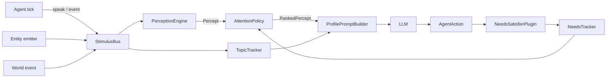

# Realistic simulation primitives (Perception layer)

WorldSim ships a physics-aware perception layer that turns the legacy
"everybody hears everybody" `MessageBus` cascade into a chain of
**Stimulus → Perception → Attention → Topic → Needs → Affordance**
steps. Agents only see what their senses can pick up, attention decides
what is worth reacting to, and the topic tracker keeps conversations
threaded.

The whole layer is opt-in. A `WorldEngine` constructed without an
`interaction` field keeps the legacy routing exactly as before.

## Status

| Phase | Topic                                                    | Status       |
|-------|----------------------------------------------------------|--------------|
| 0     | Type vocabulary (`Stimulus`, `Percept`, `Need`, `Entity`)| Complete     |
| 1     | `StimulusBus` + `PerceptionEngine`                       | Complete     |
| 2     | `AttentionPolicy` (salience, budget, threshold)          | Complete     |
| 3     | `TopicTracker` (causal threading)                        | Complete     |
| 4     | `NeedsTracker` and prompt integration                    | Complete     |
| 5     | `Entity` + `AffordanceResolver`                          | Complete     |
| 6     | Wiring through `MessageRouter`, `PersonAgent`, reports   | Complete     |
| 7     | Studio dashboard panel + REST API                        | Complete     |

The closing companion features — `NeedsSatisfierPlugin`, perception-aware
narrative analyzer, evaluation comparison runner — are documented below.

## Mental model



Each tick:

1. The `TickOrchestrator` rolls the `StimulusBus` forward (`newTick`),
   then asks each `Entity` to emit its passive stimuli (a bell rings,
   the weather shifts, a fountain murmurs).
2. Active agents publish their action through the `MessageRouter`. In
   perception mode every `speak` is converted into a `Stimulus` and
   dropped into the `StimulusBus` instead of broadcast to everyone.
3. The `PerceptionEngine` walks every (agent, stimulus) pair and decides
   if the agent perceives it: channel match, distance, sensitivity,
   intelligibility, optional `PerceptionFilter`s.
4. The `AttentionPolicy` ranks the surviving `Percept`s by salience
   (intensity, novelty, needs, goals, interests, relationships). Anything
   below threshold is silently dropped — the agent is not even prompted.
5. The `TopicTracker` clusters stimuli into open topics so the prompt can
   say "you are responding inside topic Y started by Maria".
6. The `NeedsTracker` decays/regenerates needs and feeds the result back
   into the prompt and the salience function.

## Configuration

The full config surface lives on
[`InteractionConfig`](../src/types/WorldTypes.ts):

```ts
interaction: {
  mode: "perception",            // "legacy" (default) | "perception"
  disableBroadcastFallback: true, // drop unheard stimuli instead of broadcast
  requirePerception: false,      // throw at bootstrap if perception cannot run
  defaultSenses: [               // applied to agents without their own
    { channel: "sound", radiusKm: 0.05 },
    { channel: "sight", radiusKm: 0.03 },
    { channel: "language", languages: ["it"] },
  ],
  stimulusRetentionTicks: 2,     // current + previous tick by default
  topicWindowTicks: 5,           // idle ticks before a topic is closed
  defaultNeedsTemplate: "humanBasic", // "humanBasic" | "animalBasic" | "none"
}
```

### Recipes

**Legacy (default).** Omit `interaction` entirely. Backward compatible.

**Hard perception.** Disable broadcast and require perception:

```ts
interaction: {
  mode: "perception",
  disableBroadcastFallback: true,
  requirePerception: true,
}
```

**Perception with default needs.** Apply `humanBasic` needs to every
agent that does not declare its own. `NeedsSatisfierPlugin` is
auto-registered at bootstrap unless `autoNeedsSatisfier: false`:

```ts
import { realisticInteractionPreset } from "worldsim";

interaction: realisticInteractionPreset(),
```

## Authoring custom senses

`SenseConfig` is per channel. Agents typically declare one entry per
channel they have access to:

```ts
engine.addAgent({
  id: "buddy",
  role: "person",
  name: "Buddy",
  senses: [
    { channel: "sound", radiusKm: 0.2, sensitivity: 1.4 },
    { channel: "smell", radiusKm: 0.5 },
    { channel: "sight", radiusKm: 0.05 },
  ],
});
```

Knobs:

- `radiusKm` — maximum distance the agent can pick up the stimulus on
  this channel. Ignored for `signal`, `event`, and `language`, which
  bypass physics.
- `sensitivity` — multiplier on incoming intensity (`0.6` for
  hard-of-hearing, `1.5` for a guard dog).
- `perceptionFloor` — stimuli arriving below this perceived intensity
  are dropped before attention. Useful for noisy worlds.
- `languages` (BCP-47) on the `language` channel — controls
  intelligibility of `speech` payloads. Without a matching language the
  agent perceives a generic "voice" (`intelligibility: 0`).
- `occlusionAware` — when true the engine consults a registered
  `LineOfSightProvider` to enforce walls/obstacles.

## Authoring `PerceptionFilter`s

A `PerceptionFilter` is a pure predicate `(percept, agentId) => boolean`.
The engine applies every registered filter after perception but before
attention scoring. Use it for world-specific rules:

```ts
engine
  .getPerceptionEngine()
  .addFilter((percept, agentId) => {
    if (percept.via !== "sight") return true;
    return hasLineOfSight(agentId, percept.stimulus);
  });
```

Plugin authors can also use the public hook surface:

- `onStimulusEmit` transforms or cancels a stimulus before it reaches the
  `StimulusBus`.
- `onPerceptDelivered` transforms or filters percepts before attention
  scoring.
- `onNeedsTick` transforms a needs state after the tracker's tick update.

## Tuning attention

`AttentionConfig` lives on the agent. The salience score is a weighted
average implemented in
[`AttentionPolicy.combine`](../src/perception/AttentionPolicy.ts):

| Component         | Default weight | Boost via                                 |
|-------------------|----------------|-------------------------------------------|
| intensity         | 0.25           | stimulus intensity, sensitivity           |
| novelty           | 0.10           | not in `recentPerceptStimulusIds`         |
| needRelevance     | 0.20           | `needs.tags` ↔ stimulus tags, `needWeight`|
| goalRelevance     | 0.15           | `internalState.goals` ↔ payload text      |
| interestMatch     | 0.20           | `attention.interests` ↔ tags or text      |
| relationshipBoost | 0.05           | `relationshipWeight` × graph strength     |
| recency           | 0.05           | linear decay over 5 ticks                 |

Practical tuning:

- **Distractibility** (`0..1`) shifts the threshold *down*. Set higher
  for nervous animals, lower for focused experts.
- **Budget** (default `8`) caps the number of percepts that reach the
  prompt — useful at scale to keep token usage bounded.
- **Threshold** (default `0.1`) determines when the agent stays silent.
  When zero is reached the engine emits a passive `perceive` action
  (energy cost `0`, no LLM call).

## Topics & threading

The `TopicTracker` clusters stimuli using four heuristics, in order:

1. Explicit `stimulus.topicId`.
2. Causal chain via `stimulus.causedByStimulusId`.
3. Co-participation: same source already speaking inside an open topic
   within the active window.
4. Optional `classify(stim, openTopics)` callback — useful for embedding
   similarity classifiers (Phase 7+).

Idle topics expire after `topicWindowTicks` ticks. The Studio dashboard
shows live topics, their participants and stimulus count.

When a `speak` action carries `metadata.topicId`, `metadata.inResponseTo`
or `metadata.intensity`, the `MessageRouter` propagates them through to
the resulting `Stimulus`. If the LLM omits topic metadata while replying
to an attended percept, `PersonAgent` infers `topicId` and
`inResponseTo` from the dominant percept. `causalCoherence` (in
`PerceptionMetrics`) is the fraction of speech stimuli that have a
parent — a high value means agents are answering each other instead of
talking past one another.

## Affordances

Entities may declare affordances such as `eat`, `sit`, `ride`, `open`.
When an entity is perceived, `AffordanceResolver` exposes those actions
to the agent prompt under `--- AZIONI DISPONIBILI ---`. The engine only
surfaces possibilities; plugins still own side effects and validation.

## Needs and the satisfier loop

`NeedsTracker` decays each `Need.value` per tick. Without a satisfier,
agents drift towards their critical thresholds and never recover. The
built-in [`NeedsSatisfierPlugin`](../src/plugins/built-in/NeedsSatisfierPlugin.ts)
closes the loop:

```ts
import { NeedsSatisfierPlugin } from "worldsim";

engine.use(new NeedsSatisfierPlugin());
```

Default rules (Italian + English aware):

| Match                                                 | Effect                |
|-------------------------------------------------------|-----------------------|
| `interact` payload mentions food/`mangi*`/`cibo`      | `satisfy("hunger", 0.3)` |
| `interact` payload mentions drink/`bev*`/`acqua`      | `satisfy("thirst", 0.3)` |
| `interact` payload mentions rest/`ripos*`/`dorm*`     | `satisfy("fatigue", 0.3)` |
| `finish` or `observe` with `internalState.energy < 30`| `satisfy("fatigue", 0.2)` |
| `speak` inside a topic with ≥ 2 participants          | `satisfy("social", 0.1)` |

You can replace the defaults with your own:

```ts
engine.use(new NeedsSatisfierPlugin({
  defaultRules: false,
  rules: [
    {
      id: "pet",
      match: (a) => a.actionType === "interact"
        && /accarezz/i.test(JSON.stringify(a.payload)),
      apply: (_a, satisfy) => satisfy("social", 0.4),
    },
  ],
}));
```

## Studio dashboard

The Studio plugin exposes a *Perception* sidebar item with live data
served by these endpoints:

| Method | Path                              | Purpose                              |
|--------|-----------------------------------|--------------------------------------|
| GET    | `/api/perception/status`          | Mode, default senses, topic window   |
| GET    | `/api/perception/stimuli`         | Stimuli emitted on the current tick  |
| GET    | `/api/perception/topics`          | Open topics + participants           |
| GET    | `/api/perception/percepts/:agent` | What this agent is currently hearing |
| GET    | `/api/perception/needs/:agent`    | Need values, active/critical flags   |

The page auto-refreshes when the simulation ticks and exposes a quick
"What is each agent attending to right now?" view that is invaluable
when debugging silence or off-topic replies.

## Reports & narrative

The `ReportGeneratorPlugin` extends `SimulationMetrics` with a
`perception` block (totals by kind/channel, topic count, `replyRate`,
`causalCoherence`, average participants per topic). The
stimulus totals are based on the `StimulusBus` retention window; the
report includes `retainedStimulusTicks` and
`stimulusMetricsLimitedByRetention` so downstream readers can distinguish
full-run topic metrics from retained-window stimulus metrics. When the
report generator plugin is active, `cumulativeTotalStimuli` and
`cumulativeStimuliByKind` provide monotonic full-run counts. The
`NarrativeAnalyzer` (when enabled) builds a `PerceptionInsights` block
in the `NarrativeReport` summarising dominant topics, silence ratio and
critical-need moments — see
[`src/analysis/narrative.ts`](../src/analysis/narrative.ts).

## Recipes by scenario family

### Human community (village, office, family)

```ts
interaction: {
  mode: "perception",
  defaultNeedsTemplate: "humanBasic",
  defaultSenses: [
    { channel: "sound", radiusKm: 0.05 },
    { channel: "sight", radiusKm: 0.03 },
    { channel: "language", languages: ["it"] },
  ],
  topicWindowTicks: 5,
}
```

Use entities for shared landmarks (church bell, fountain, coffee
machine) and register `NeedsSatisfierPlugin` to close the loop.

### Animal enclosure

```ts
interaction: {
  mode: "perception",
  defaultNeedsTemplate: "animalBasic",
  defaultSenses: [
    { channel: "sound", radiusKm: 0.2 },
    { channel: "smell", radiusKm: 0.5 },
    { channel: "sight", radiusKm: 0.05 },
  ],
  topicWindowTicks: 3,
}
```

Drop the `language` sense; agents communicate through `sound` and
`smell` only. Add an entity per food/water source with a `smell`
emitter so hungry animals can detect it.

### Office floor / signal-driven

```ts
interaction: {
  mode: "perception",
  defaultSenses: [
    { channel: "sound", radiusKm: 0.01 },
    { channel: "language", languages: ["it"] },
    { channel: "signal" },
    { channel: "event" },
  ],
}
```

`signal` and `event` bypass physics — perfect for chat messages, push
notifications, broadcast announcements. Combine with a tiny `sound`
radius so face-to-face conversations stay local.

## Further reading

- [Architecture overview](./architecture.md)
- [Plugin authoring](./plugins.md)
- [Evaluation scenarios](../evaluation/README.md)
- [`examples/realistic-village/`](../examples/realistic-village/)
